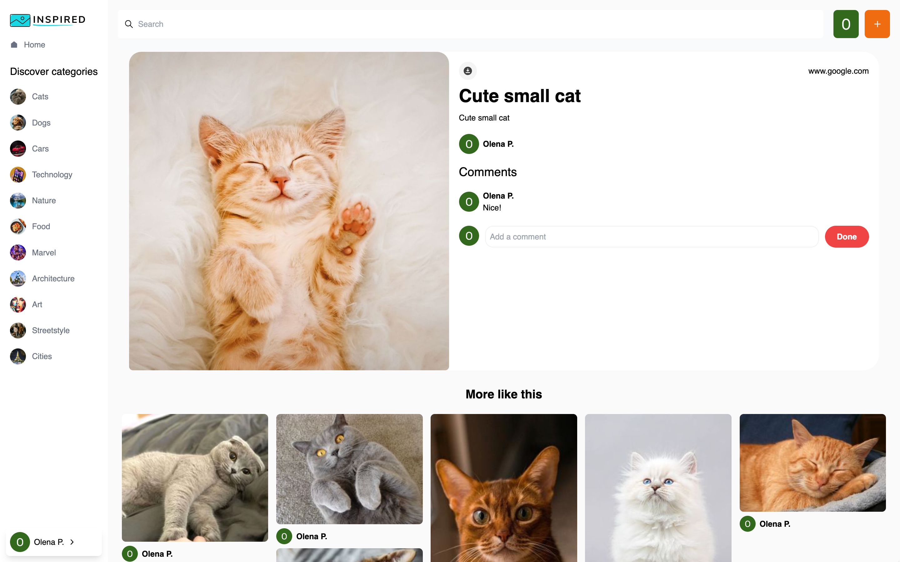

# Link to live demo

To see a live demo of my app, visit https://olenapolko.github.io/inspired-project/

# Description

Inspired is a photo-sharing platform written in React that allows users to share their photos, like and comment on them, and save them to their own collections. Users can search for photos by name or description and upload their own photos from their computer as well as download them from the app. The app uses React OAuth2 for user authentication and Sanity.io for the backend part. The styles are implemented using Tailwind.css.

# Technologies

- React
- Tailwind CSS
- Sanity.io
- OAuth2

# Screenshots

